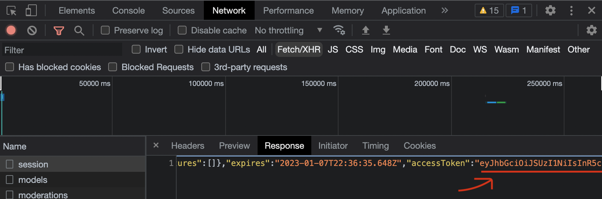

# PyChatGPT

Yet another Python wrapper around the OpenAI's chat GPT amazing new AI. For fun purposes only

## Installation

To install dependencies needed run:

_**$**_ `pip install -r requirements.txt`

## Script usage

```
$ python3 chat.py -h 
usage: chat.py [-h] -p PROMPT [-d]

Send a prompt to OpenAI's chat API

optional arguments:
  -h, --help            show this help message and exit
  -p PROMPT, --prompt PROMPT
                        Prompt for the AI
  -d, --debug           Executes in debug mode with more logs
```

Example
```
$ export OPENAI_TOKEN="<your_token>"
$ python3 chat.py -p "Write a cover letter for an Android Developer role at Microsoft"

Dear Hiring Manager,

I am writing to apply for the Android Developer role at Microsoft. I am a highly skilled Android developer with over 5 years of experience in the field.

In my current role at XYZ Company, I have been responsible for the development and maintenance of multiple Android applications. I have extensive experience with the Android SDK and have a strong understanding of the latest technologies and best practices in Android development. I have also worked closely with design and product teams to deliver intuitive and user-friendly app experiences.

I am a team player and am comfortable collaborating with others to achieve a common goal. I am also constantly learning and staying up-to-date with the latest advancements in Android development.

I am excited about the opportunity to join the team at Microsoft and contribute to the development of innovative Android applications. Thank you for considering my application. I look forward to the opportunity to discuss this further.

Sincerely,

[Your Name]
```

## API Token

In order to use the script you need to obtain a authentication token and export it as environment variable (`OPENAI_TOKEN`).

A simple way of retrieving one is to:
- Login in https://chat.openai.com and use Chrome Dev Tools pressing `F12`
- In the Dev Tools filter by `Fetch/XHR`
- Find the network call called `session` and go to the `Response` tab
- Scroll in the response to the last field called `accessToken` and copy the value
- Export it as a environment variable like `export OPENAI_TOKEN="<the token you copied>"`





## Notes

This is a small wrapper to play around with https://chat.openai.com from a python script. It's meant to be for fun and prototyping, so I wouldn't recommend using it in any production application.

For now the script doesnt allow token refreshing, so every now and then you might need to update it.

## Credits

Of course, [OpenAI](https://openai.com/)